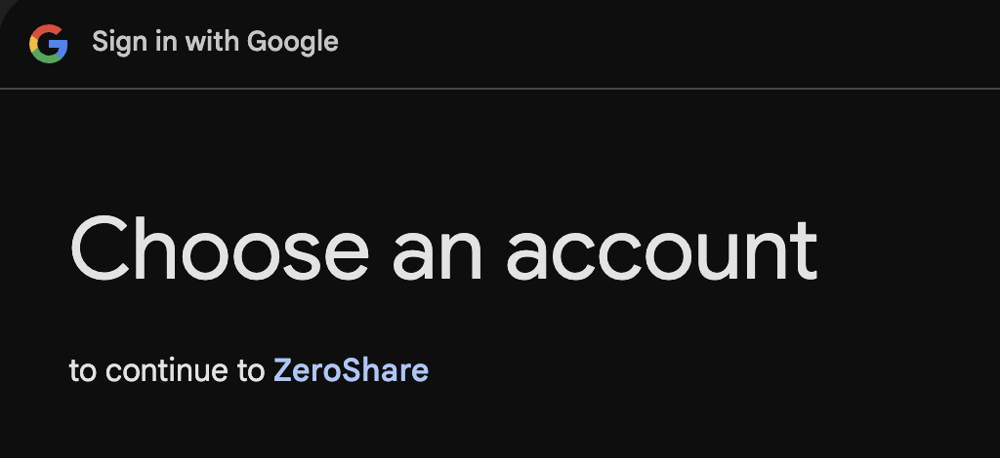

#Method 1: Automated Setup (Recommended)

The easiest way to set up ZeroShare is using the automated setup script:

## Prerequisites
- Go 1.22 or later
- Docker and Docker Compose


```bash linenums="1"
curl -O https://raw.githubusercontent.com/jobinlawrance/zeroshare-backend/main/scripts/setup.go

go mod init setup && go get github.com/goccy/go-yaml@latest github.com/urfave/cli/v2@latest && go run setup.go
```

This script will automatically:

1. Pull the required docker services
2. Set up certificates & start Nebula Lighthouse
3. Start the Go backend
4. Monitor backend service using OpenTelemetry


To test the backend, you can visit the below link and if everything is successful you should be redirected to Google's Sign in Page.

```plaintext
http://localhost:4000/login/test
```
