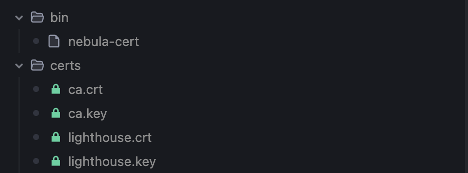
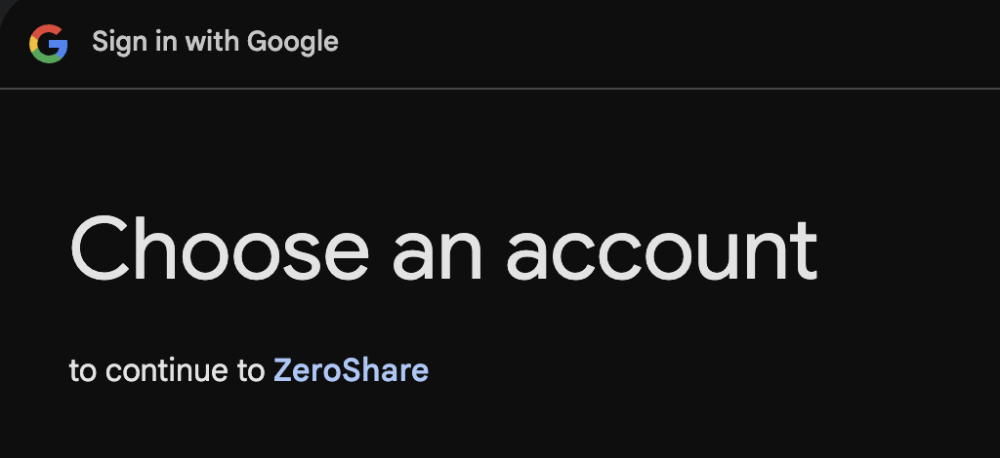
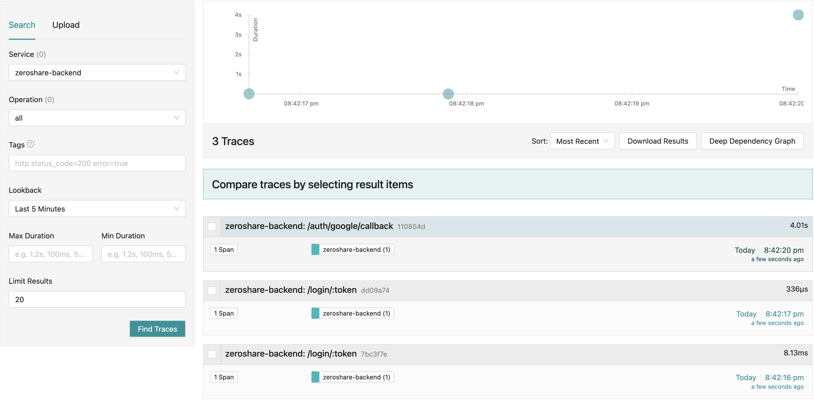

## Method 2: Manual Setup with Docker Compose

If you prefer to set up manually with Docker, follow these steps:

We'll start with creating a workspace to store the configs, scripts, and certificates

 ```bash linenums="1"

 mkdir zeroshare-backend && cd zeroshare-backend
 mkdir scripts
 ```


### Compose file

Download the compose file from [here](https://github.com/jobinlawrance/zeroshare-backend/raw/refs/heads/main/docker-compose.yml)

```bash  linenums="1"
curl -L -O https://github.com/jobinlawrance/zeroshare-backend/raw/refs/heads/main/docker-compose.yml
```
### Nebula Lighthouse

Each client in our application acts as a Nebula node, requiring a Lighthouse node for certificate management. The Lighthouse generates and manages certificates for all nodes in the network.

Our docker setup creates a debian container running `start-lighthouse.sh`, which downloads the appropriate Nebula binary and generates certificates in the `certs` folder. This folder is mounted to the Go backend for signing client certificates during signup.

For technical details about the data flow, see our documentation [here](https://github.com/jobinlawrance/zeroshare-backend/blob/main/scripts/start-lighthouse.sh).

Create the following directory structure and files:

```plaintext
zeroshare-backend/
├── config/
│   └── config.yml
└── scripts/
    └── start-lighthouse.sh 

```

You can download these using 

```bash linenums="1"
mkdir -p config scripts

# Download config.yml
curl -o config/config.yml https://raw.githubusercontent.com/jobinlawrance/zeroshare-backend/main/config/config.yml

# Download start-lighthouse.sh
curl -o scripts/start-lighthouse.sh https://raw.githubusercontent.com/jobinlawrance/zeroshare-backend/main/scripts/start-lighthouse.sh

# Make the script executable
chmod +x scripts/start-lighthouse.sh
```

### Environment Variables

Finally, create a `.env` file with the following environment variables:

```shell linenums="1"
PORT=4000
DB_HOST=db       
DB_USER=postgres
DB_PASSWORD=root
DB_NAME=zeroshare
DB_PORT=5432
DB_SSLMODE=disable
DB_TIMEZONE=Asia/Kolkata  # Or your timezone
REDIS_HOST=redis
REDIS_PORT=6379
REDIRECT_URL=http://localhost:4000/auth/google/callback
OTEL_METRICS_ENABLED=false
OTEL_LOGS_ENABLED=false
OTEL_TRACING_ENABLED=true
OTEL_EXPORTER_OTLP_ENDPOINT=jaeger:4317
CLIENT_ID=          # Your Google client ID
CLIENT_SECRET=      # Your Google client secret
AUTH_SECRET=        # Generate a random auth secret for JWT
```

Replace the values for Google's client ID and secret from earlier step. 

To generate a random secret for auth you can use the below bash command

```bash
openssl rand -base64 32
```

Now that we have all the prerequisites in place, we can start the application:

```bash
docker compose up -d
```

If everything succeeded, you should be able to see the below files



To test the backend, you can visit the below link and if everything is successful you should be redirected to Google's Sign in Page.

```plaintext
http://localhost:4000/login/test
```


This setup also has an in-memory tracing enabled which is good enough for debugging in dev environments. 

You can visit the below link to see the traces 

```plaintext
http://localhost:16686/search
```

And for our previous login test, the traces are visible.



For a more comprehensive monitoring, check the prod setup using Clickhouse here