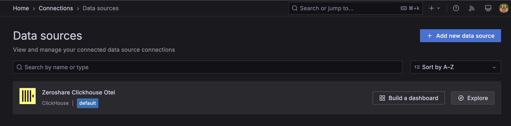
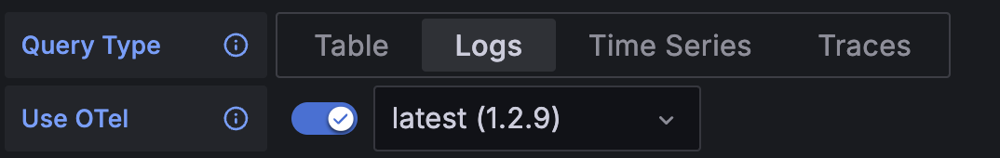
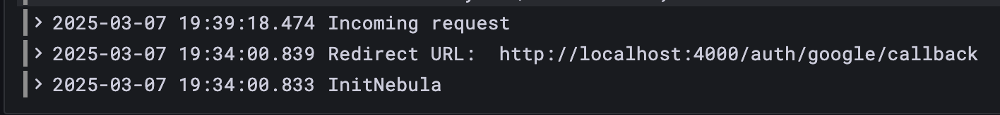
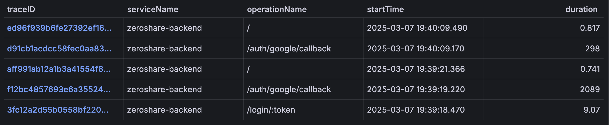

# OpenTelemetry with Clickhouse Backend

### Updating compose file

For a permanent setup, we just need to comment out the Jaeger service in our docker compose file and uncomment the otel-collector, clickhouse and grafana services.

```yaml linenums="1"
 otel-collector:
    container_name: otel-collector
    image: otel/opentelemetry-collector-contrib
    volumes:
      - ./otel/otel-collector-config.yaml:/etc/otelcol-contrib/config.yaml
    ports:
      - 1888:1888 # pprof extension
      - 8888:8888 # Prometheus metrics exposed by the Collector
      - 8889:8889 # Prometheus exporter metrics
      - 13133:13133 # health_check extension
      - 4317:4317 # OTLP gRPC receiver
      - 4318:4318 # OTLP http receiver
      - 55679:55679 # zpages extension
    networks:
      - zeroshare
    depends_on:
      - clickhouse

  clickhouse:
    container_name: clickhouse
    image: clickhouse/clickhouse-server:latest
    volumes:
      - ./otel/clickhouse-init:/docker-entrypoint-initdb.d
    ports:
      - "9000:9000"
      - "8123:8123"
    networks:
      - zeroshare

  grafana:
    container_name: grafana
    image: grafana/grafana:latest
    volumes:
      - ./otel/grafana.ini:/etc/grafana/grafana.ini
      - ./otel/datasource.yaml:/etc/grafana/provisioning/datasources/datasource.yaml
    environment:
      GF_INSTALL_PLUGINS: grafana-clickhouse-datasource
    ports:
      - "3001:3000"
    networks:
      - zeroshare
    depends_on:
      - clickhouse
```


Do not forget to comment the Jaeger service as we are using Jaeger's all-in-one service which acts as a collector as well as the Jaeger UI.

Since we are using the official opentelemetry colllector above, this will leave to port conflicts if not commented.

```yaml linenums="1"
#   jaeger:
#     container_name: jaeger
#     environment:
#     - COLLECTOR_OTLP_ENABLED=true
#     image: jaegertracing/jaeger:2.3.0
#     networks:
#     - zeroshare
#     ports:
#     - 16686:16686
#     - 4317:4317
#     - 4318:4318
#     - 5778:5778
#     - 9411:9411
#     restart: unless-stopped
```

### Config files

Now we need a couple of config files to get this working.

#### `otel-collector-config.yaml`

The collector config file is pretty straight forward. We are using the all-in-one config file which is located at [`otel/otel-collector-config.yaml`](https://github.com/jobinlawrance/zeroshare-backend/blob/main/otel/otel-collector-config.yaml). It basically describes how we want to receive and send telemetry data.

You can read more about configuring the collector [here](https://opentelemetry.io/docs/collector/configuration/)

#### `clickhouse-init`

This is a folder which contains a single file [`init-db.sql`](https://github.com/jobinlawrance/zeroshare-backend/blob/main/otel/clickhouse-init/init-db.sql) which is used to initialize the clickhouse database.

This sql file just does 
```sql 
CREATE DATABASE IF NOT EXISTS otel;
```

#### `grafana.ini`

This is the grafana config file which is used to configure the grafana instance. It is located at [`otel/grafana.ini`](https://github.com/jobinlawrance/zeroshare-backend/blob/main/otel/grafana.ini)

#### `datasource.yaml`

This is the datasource config file which is used to configure the clickhouse datasource in grafana using Clickhouse's official [Grafana Plugin](https://grafana.com/grafana/plugins/grafana-clickhouse-datasource/).
It is located at [`otel/datasource.yaml`](https://github.com/jobinlawrance/zeroshare-backend/blob/main/otel/datasource.yaml).

!!! info
    As an alternative, you can also use Altinity's [Grafana Plugin for Clickhouse](https://grafana.com/grafana/plugins/vertamedia-clickhouse-datasource/) as an alternative or in tandem with the official plugin.

-----

### Starting the services

Let's quickly pull all the above config files and directory structure before staring the services.

```bash linenums="1"
mkdir -p otel/clickhouse-init
curl -o otel/otel-collector-config.yaml -L https://github.com/jobinlawrance/zeroshare-backend/raw/refs/heads/main/otel/otel-collector-config.yaml
curl -o otel/clickhouse-init/init-db.sql -L https://github.com/jobinlawrance/zeroshare-backend/raw/refs/heads/main/otel/clickhouse-init/init-db.sql
curl -o otel/grafana.ini -L https://github.com/jobinlawrance/zeroshare-backend/raw/refs/heads/main/otel/grafana.ini
curl -o otel/datasource.yaml -L https://github.com/jobinlawrance/zeroshare-backend/raw/refs/heads/main/otel/datasource.yaml

chmod +x otel/otel-collector-config.yaml
chmod +x otel/clickhouse-init/init-db.sql
chmod +x otel/grafana.ini
chmod +x otel/datasource.yaml
```

Also we need to enable the otel environment variables and update the otel endpoint to `otel-collector:4317`

```bash linenums="1" title=".env"
OTEL_METRICS_ENABLED=true
OTEL_LOGS_ENABLED=true
OTEL_TRACING_ENABLED=true
OTEL_EXPORTER_OTLP_ENDPOINT=otel-collector:4317
```

And finally we can start `docker compose up -d`.

Just like earlier to make sure everything is working as intented we can hit the below backend endpoint

[http://localhost:4000/login/test](http://localhost:4000/login/test){:target="_blank"}

And view the telemetry data in grafana at [http://localhost:3001/](http://localhost:3001/){:target="_blank"}

Default credentials are `admin` as username and password.

Once logged in, navigate to `Home -> Connections -> Data sources` and we can see `ZeroShare Clickhouse Otel`



- Click On Explore 
- Select Query type as `Logs` or `Traces`
- Enable `Use Otel`
    
- Run Query






Even though metrics is logged in clickhouse, I haven't setup an ui for it. Prometheus or something can be configured as required. 

We can view the metrics related data in Clickhouse using the below query

```bash
docker exec -it clickhouse clickhouse-client
```

```sql
use otel;

SHOW TABLES;
```

```{ .text .no-copy }
   ┌─name───────────────────────────────┐
1. │ otel_logs                          │
2. │ otel_metrics_exponential_histogram │
3. │ otel_metrics_gauge                 │
4. │ otel_metrics_histogram             │
5. │ otel_metrics_sum                   │
6. │ otel_metrics_summary               │
7. │ otel_traces                        │
8. │ otel_traces_trace_id_ts            │
9. │ otel_traces_trace_id_ts_mv         │
   └────────────────────────────────────┘
```