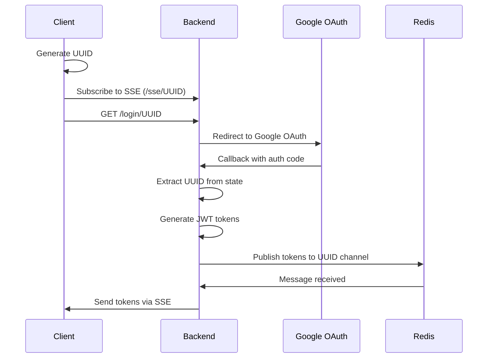
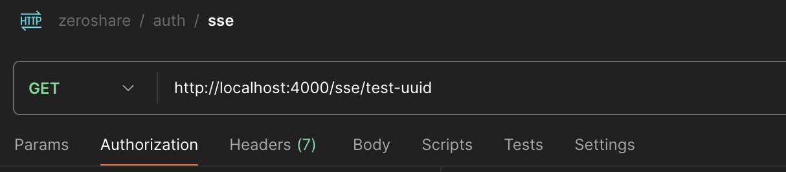
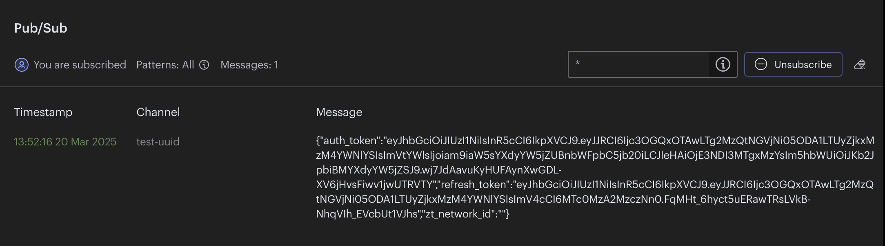
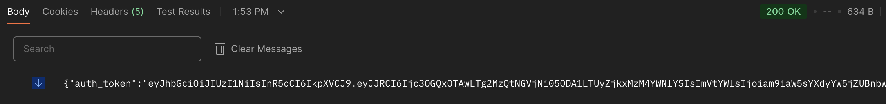

The authentication in ZeroShare is a simple Google Outh2 authentication, implemention of which varies depending on the platform.

## Desktop (Web)

This is the most dettached version of the authentication flow which can be used in future for web applications, cli etc.

The client creates a uuid and redirects the user to the login url. 

```http://localhost:4000/login/unique-id```

Along with the redirection, the client also subscribes to a server side event for the same uuid.

Once the backend successfully authenticates the login, it emits the `auth_token` and `refresh_token` to the client.

### Backend Flow

When the above url is hit, the backend generates a oAuth url with the above uuid as a `state` variable.

```go
	app.Get("/login/:token", func(c *fiber.Ctx) error {
		sessionToken := c.Params("token")
		url := oauthConf.AuthCodeURL(sessionToken)
		return c.Redirect(url)
	})
```

When Google Authentication is complete, it hits our redirect url and we extract the this uuid back to know which user is being authenticated.

```go
sessionToken := c.Query("state")
```

Then a user is created (if not exists) and JWT tokens are generated. These info are then send to a redis channel with the same uuid.

```go
redisStore.Publish(context.Background(), sessionToken, jsonData)
```

#### Server Side Event

When the client hits the login url with a `uuid` it also subscribes to a server side event with the same uuid as the channel id.

```go
    app.Get("/sse/:sessionToken", func(c *fiber.Ctx) error {
		sessionToken := c.Params("sessionToken")
		return controller.SSE(c, redisStore, sessionToken)
	})
```

This function just subscribes to the redis channel and sends the data to the client.

```go
subscriber := redisStore.Subscribe(context.Background(), sessionToken)
```

and once it receives a messages, it sends the data back to the SSE stream. 

This whole flow can be visualized using Postman and running the backend locally. For instructions on setting up the backend locally, check out the [Self Hosting Guide](../Self%20Hosting/index.md).

### Visualizing the Auth Flow



For testing lets use `test-uuid` as the unique id.

1. #### Subscribe to SSE

    

2. #### Hit the Login url

    ```http//localhost:4000/login/test-uuid```
    
    And complete the Google Sign in.

3. #### Redis Pub/Sub

    

4. #### SSE Result

    The same message is sent back to the client.

    

