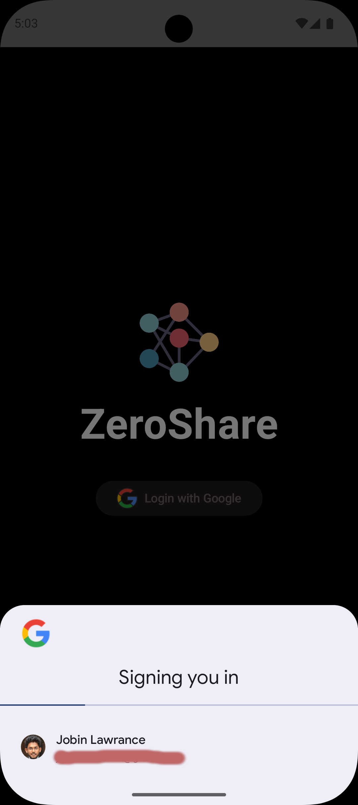
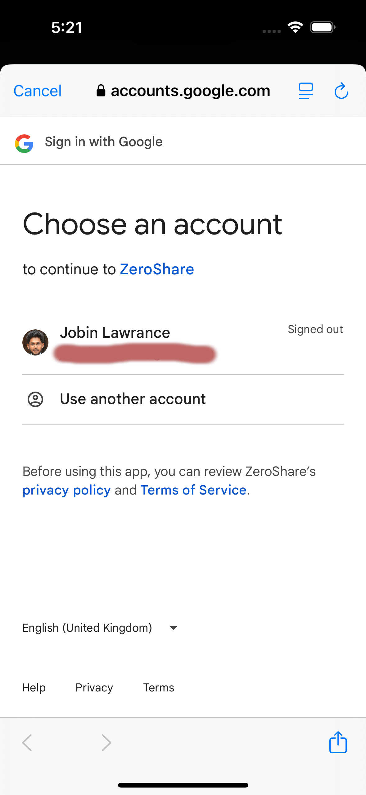

The authentication in ZeroShare is a simple Google OAuth2 authentication, implementation of which varies depending on the platform.

## Desktop (Web)

This is the most detached version of the authentication flow which can be used in future for web applications, CLI etc.

The client creates a UUID and redirects the user to the login URL.

```http:%2F%2Flocalhost%3A4000%2Flogin%2Funique-id%60%60%60

Along with the redirection, the client also subscribes to a server-side event for the same UUID.

Once the backend successfully authenticates the login, it emits the `auth_token` and `refresh_token` to the client.

### Backend Flow

When the above URL is hit, the backend generates an OAuth URL with the above UUID as a `state` variable.

```go
	app.Get("/login/:token", func(c *fiber.Ctx) error {
		sessionToken := c.Params("token")
		url := oauthConf.AuthCodeURL(sessionToken)
		return c.Redirect(url)
	})
```

When Google Authentication is complete, it hits our redirect URL and we extract this UUID back to know which user is being authenticated.

```go
sessionToken := c.Query("state")
```

Then a user is created (if not exists) and JWT tokens are generated. This info is then sent to a Redis channel with the same UUID.

```go
redisStore.Publish(context.Background(), sessionToken, jsonData)
```

#### Server Side Event

When the client hits the login URL with a UUID, it also subscribes to a server-side event with the same UUID as the channel ID.

```go
    app.Get("/sse/:sessionToken", func(c *fiber.Ctx) error {
		sessionToken := c.Params("sessionToken")
		return controller.SSE(c, redisStore, sessionToken)
	})
```

This function just subscribes to the redis channel and sends the data to the client.

```go
subscriber := redisStore.Subscribe(context.Background(), sessionToken)
```

and once it receives a message, it sends the data back to the SSE stream.

## Mobile 

The Android and iOS clients use their respective Google Auth SDKs to provide a native login experience.

| Android | iOS |
|---------|-----|
|  |  |
| Uses [Android's Credential Manager](https://developer.android.com/identity/sign-in/credential-manager-siwg) which also allows for automatic sign-in for returning users as shown in the image above. | Uses Google's `GoogleSignIn` and `GoogleSignInSwift` packages to login. |
| Android implementation can be found [here](https://github.com/jobinlawrance/zeroshare-multiplatform/blob/main/shared/src/androidMain/kotlin/live/jkbx/zeroshare/controllers/GoogleAuthUiProviderImpl.kt) | iOS implementation can be found [here](https://github.com/jobinlawrance/zeroshare-multiplatform/blob/main/iosApp/iosApp/screens/LoginScreen.swift) |

After the user successfully logs in, the SDK returns a Google token which is then used to authenticate the user. This is sent to the backend in the below endpoint.

```http://localhost:4000/login/verify-google```

Here the backend verifies the token using Go's `google.golang.org/api/idtoken` package and extracts the details and returns the JWT tokens.

```go
payload, err := idToken.Validate(context.Background(), token, os.Getenv("CLIENT_ID"))
	if err != nil {
		log.Println(err)
		return structs.TokenResponse{}, err
	}

	user := structs.User{
		Email:         payload.Claims["email"].(string),
		FamilyName:    payload.Claims["family_name"].(string),
		GivenName:     payload.Claims["given_name"].(string),
		Locale:        "",
		Name:          payload.Claims["name"].(string),
		Picture:       payload.Claims["picture"].(string),
		VerifiedEmail: payload.Claims["email_verified"].(bool),
	}
```

## Saving Token.

Since all our clients are kotlin multiplatform, the code to save the tokens remain the same.

```kotlin
settings.putString(tokenKey, sseEvent.token)
settings.putString(refreshTokenKey, sseEvent.refreshToken)
```

In Android and iOS, this happens after the verify google endpoint is hit and in Desktop it happens in the SSE endpoint.

[Settings](https://github.com/russhwolf/multiplatform-settings) is a kotlin multiplatform library which uses

- `SharedPreferences` on Android
- `NSUserDefaults` on iOS
- `PreferencesSettings` on JVM (Desktop)