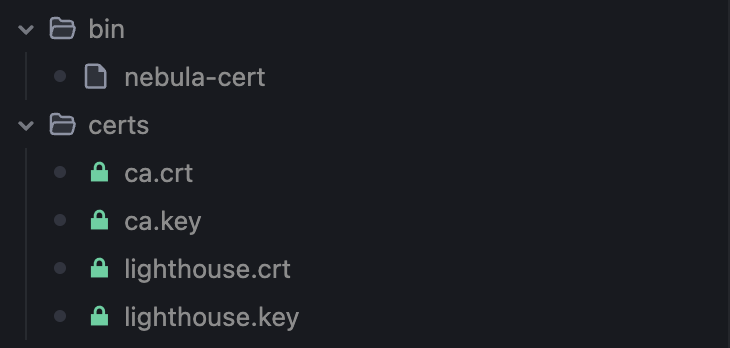

Signing the public key.

The Go Backend exposes a `/nebula/sign-public-key` endpoint which the clients use to sign the public key. Before getting into the details, let's see how the backend and nebula lighthouse service work together. 


## Nebula Lighthouse Docker Service.

The Nebula Lighthouse docker service I am creating is just a `debian:bullseye-slim` image which runs a startup script which does the following:

- Mounts the following shared directories which the backend service can also use
    - `certs`  - The CA & Lighhouse certificates are generated here
    - `config` - The config.yaml file for Lighthouse is located here
    - `bin` - The `nebula-cert` binary is copied here
    - `scripts` - The `startup-script.sh` is located here


```yaml
  nebula-lighthouse:
    image: debian:bullseye-slim
    container_name: nebula-lighthouse
    volumes:
      - ./certs:/certs
      - ./config:/config
      - ./bin:/shared-bin
      - ./scripts:/scripts
    entrypoint: ["/bin/sh", "-c", "apt-get update && apt-get install -y iputils-ping 
    && /scripts/start-lighthouse.sh"]

```

The bash script [`start-lighhouse.sh`](https://github.com/jobinlawrance/zeroshare-backend/blob/main/scripts/start-lighthouse.sh) we run as entrypoint does the following:

- Downloads the latest nebula binaries for the host's OS and architecture
- Copies the `nebula-cert` binary to the shared `bin` directory
- Creates CA certificates
    ```bash
    ./nebula-cert ca -name 'ZeroShare, Inc' -out-crt /certs/ca.crt -out-key /certs/ca.key
    ```
- Creates keypair for Nebula Lighthouse (Lighthouse is also a Nebula node)
    ```bash
    ./nebula-cert sign -name 'lighthouse' -ip '69.0.0.1/8' -groups 'lighthouse' \
    -out-crt /certs/lighthouse.crt -out-key /certs/lighthouse.key \
    -ca-crt /certs/ca.crt -ca-key /certs/ca.key
    ```

Here we assign `69.0.0.1` as the IP address for the Nebula Lighthouse node.

The first time we run the above docker service we can see these certificates and binary in the same directory as the docker-compose file.



Finaly the script starts the Nebula service using this config.yaml file:

```yaml
pki:
  ca: /certs/ca.crt
  cert: /certs/lighthouse.crt
  key: /certs/lighthouse.key

lighthouse:
  am_lighthouse: true
  interval: 60
#   Rest of the config
```

```bash
./nebula -config /config/config.yml
```

## Backend as the Certificate Authority.

Here the client creates the public and private key on the device itself and provides the backend with the public key.

The endpoint takes the below JSON as input:
```json
{
  "public_key": "-----BEGIN NEBULA X25519 PUBLIC KEY-----\nJDir1tojHp3fVFRfkbWMBlDQ6A5m7EXWHCiN4zBeY0U=\n-----END NEBULA X25519 PUBLIC KEY-----\n",
  "device_id": "572a2beb-9c90-422c-af26-b434af9c329e"
}
```

The backend first checks if the client (via it's device_id) has an existing Nebula IP address assigned to it. From the earlier registration step, the first time a device is created, we left the `ip_address` field empty. 

