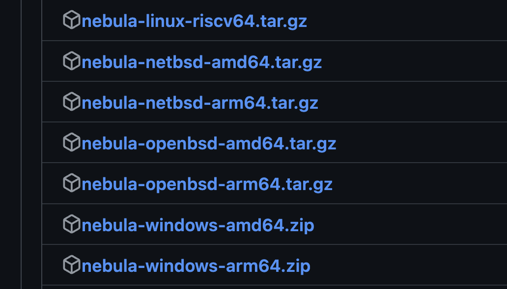

Here I am setting up the Nebula client as we normally would on a desktop environment.
I used this [article](https://www.apalrd.net/posts/2023/network_nebula/) as a guide for the setup process.

The desktop client does the following:

- Checks if Nebula binaries are present in the system and downloads them if not.
- Create the keypair
- Send it to backend to be signed.
- Create the nebula `config.yml` file.
- Start the nebula client.

Let's look at each points in details.

# Downloading the Nebula binaries

```kotlin
private suspend fun checkAndInstallNebula(
        messages: (String) -> Unit,
        downloadProgress: (Int) -> Unit
    ) {
        val nebulaExists = runCommand("which nebula")
        log.d { nebulaExists }
        if (nebulaExists.contains("/usr/local/bin/nebula")) {
            // we already have nebula
            log.d { "Nebula already exists" }
            messages("Nebula is installed at $nebulaExists")
        } else {
            downloadNebula(messages, downloadProgress)
        }
    }
```

This basically checks if the nebula binary is presents in the system, if not we get the latest binaries from nebula's github releases.

```kotlin
val os = detectOS()
val arch = detectArchitecture()
val githubApi = "https://api.github.com/repos/slackhq/nebula/releases/latest"
val release = client.get(githubApi).body<GithubReleaseResponse>()
```

Nebula's Release assets looks like this:


Now we need to find the correct asset for our OS and Architecture and download it.

```kotlin
val osAssets = release.assets.filter { it.name.contains(os, ignoreCase = true) }
val asset = if (osAssets.size == 1) {
    osAssets.first()
} else {
    osAssets.find { it.name.contains(arch, ignoreCase = true) }
    ?: run {
        log.d { "No matching asset found for OS: $os and Architecture: $arch" }
        return
    }
}
val file = downloadFile(asset.browserDownloadUrl, asset.name, downloadProgress)
```
Then extract the files, make them executable and move them to `/usr/local/bin/`.

```kotlin
val tempFileDir = withContext(Dispatchers.IO) {
    Files.createTempDirectory("tmpDir")
}

extractAndPlaceBinary(file, tempFileDir.absolutePathString())

withContext(Dispatchers.IO) {
    Files.walk(tempFileDir)
}.forEach {
    runCommand("chmod +x ${it.absolutePathString()}")
}

val mvResult = runWithAdminPrivilegesMac("cp -r $tempFileDir/* /usr/local/bin/")
runCommand("rm -rf ${tempFileDir.absolutePathString()}")
runCommand("rm ${file.absolutePath}")
```

This places two binaries `nebula` and `nebula-cert` in `/usr/local/bin/`.

# Create the keypair

```kotlin
val process = withContext(Dispatchers.IO) {
    ProcessBuilder(
        "nebula-cert",
        "keygen",
        "-out-key", tempDir.resolve("host.key").toString(),
        "-out-pub", tempDir.resolve("host.pub").toString()
    ).directory(tempDir.toFile()) // Ensure command runs in the temp directory
        .redirectErrorStream(true) // Combine error stream with output stream
        .start()
}
```

This is running the `nebula-cert keygen` command to create a public and private key. This public key is then send to backend server at /
